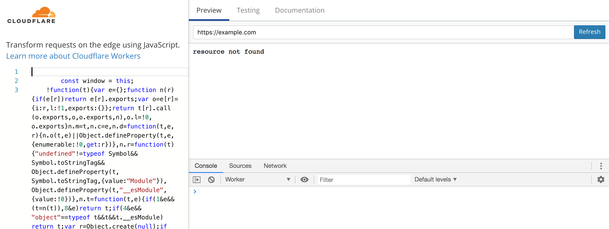
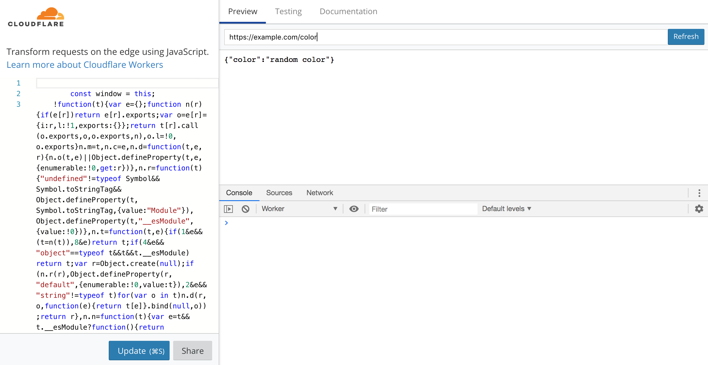
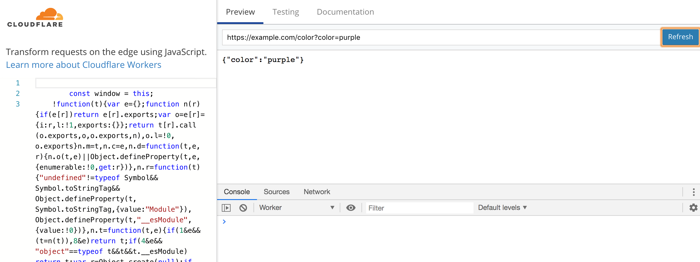
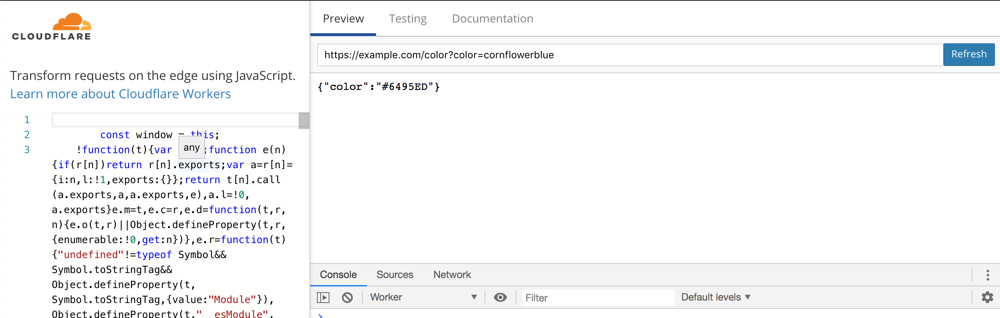
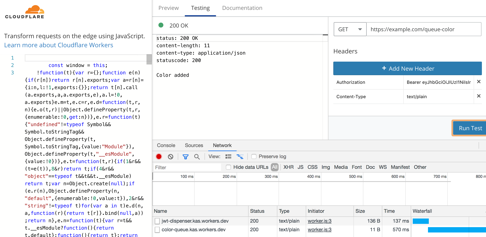

# Cloudflare Workers Workshop Instructions

Remember to have everything from the [prerequisites](./README.md#prerequisites) ready.

## Part 0 Getting started

First, we need to install Wrangler, set it up. and pull down a boilerplate project.

### Installing Wrangler

The steps to install using Node.js via npm or Rust via cargo can be found [in the Wrangler README](https://github.com/cloudflare/wrangler)

### Configuring Wrangler

Use the [`wrangler config`](https://github.com/cloudflare/wrangler#Configuration) command to set up your global user. You will need the email you used to sign up and your [API key](https://support.cloudflare.com/hc/en-us/articles/200167836-Where-do-I-find-my-Cloudflare-API-key-)

## Our first application: using a Template Gallery boilerplate

Our first Workers application will use a [Template Gallery](https://workers.cloudflare.com/docs/templates/) boilerplate as its base, specifically the Router boilerplate. Run the following to set up tho boilerplate:

```bash
wrangler generate color-app https://github.com/cloudflare/worker-template-router
```

This will create a `color-app` folder in the directory you ran the command in. Run `cd color-app` and open the folder in your favorite code editor.

## Part 1: Creating our own routes

### Creating our new route

1. add a `require` statement to bring in the `url` library to line 1:

```javascript
// new code
const url = require('url')
// end new code
const Router = require('./router')
```

1. rename the `handler` function to `getColor`

```javascript
function getColor(request) {
```

1. create a `color_url` and `my_color` variable within the getColor function that will craft a URL object and extract the query string parameter `color`, respectively:

```javascript
function getColor(request) { 
	// new code
	const color_url = new URL(request.url).search
	const my_color = new URLSearchParams(color_url).get('color')
	// end new code
```

1. After the creation of the body and headers, add an `if` statement that will set `body` to the value of the `color` query if one was sent, and the string `random color` otherwise

```javascript
let body
let init = {
	headers: {
		'content-type': 'application/json',
		statusCode: 200
	}
}

// new code
if (my_color){
	body = my_color
} else {
	body = random_color
}
// end new code

return new Response(body, init)
```

1. In the `handleRequest` function, get rid of the routes and add one for your new `getColor` function:

```javascript
async function handleRequest(request) {
    const r = new Router()
    // new code
		r.get('.*/color/*', () => handler(request))
		// end of new code
    const resp = await r.route(request)
    return resp
}
```

### Testing our route

1. In the `color_app` directory, run `wrangler preview`. After some thinking, you'll be taken to your browser, where you should see the following:



1. In the URL bar, add /color to https://example.com and you should see:



1. Finally, add `?color=purple` to the end of the url to get:
 


If that all works, we're ready to require an npm module to parse our colors to hex!

## Parsing colors with the npm `color` module

### Install and include the `color` module

In your `color_app` directory, run:

```bash
npm i color
```

At the top of your `index.js` file, add a `require` statement to bring in the module:

```javascript
const url = require('url')
const Router = require('./router')
// new code
const color = require('color')
// end new code
```

Now, let's add color parsing into the if statement where we get a `color` query string parameter:

```javascript
if (my_color) {
	// new code
	try {
		my_color = color(my_color).hex()
	} catch (err) {
		init.headers.statusCode = 400
		body = JSON.stringify({error: 'invalid color'})
			return new Response(body, init)
	}
	// end new code
	body = JSON.stringify({ color: my_color.hex() })
} else { 
```

And in our else statement, let's generate an actual random color and send it back: 

```javascript
} else { 
	// new code
	my_color = color({
		r: Math.round(Math.random() * 255),
		g: Math.round(Math.random() * 255),
		b: Math.round(Math.random() * 255)
	})
	body = JSON.stringify({ color: my_color.hex() })
	// end new code
}
```

### Testing

Run `wrangler preview` in your `color_app` directory and add /color to the end of the URL to get a random color in hex:


Then add a `color` query parameter, like `?color=cornflowerblue`



## Calling outside functions

### Getting a JWT from color-queue.kas.workers.dev

first, we'll create a new route to handle getting and sending colors to the queue. In your `handleRequest` function:

```javascript
async function handleRequest(request) {
	const r = new Router()
	// Replace with the approriate paths and handlers
	r.get('.*/color/*', () => getColor(request))
	// new code
	r.get('.*/queue-color/*', () => sendColor(request))
	// end new code
	const resp = await r.route(request)
	return resp
}
```

Next we'll create the `sendColor` function and copy the contents of `getColor` into it (we'll be reusing a lot of it). Note the changes below; specifically adding `async` to the function declaration-- this allows us to use `await` in the function.

```javascript
async function sendColor(request) {
	const color_url = new URL(request.url).search
	let my_color = new URLSearchParams(color_url).get('color')

	let body
	let init = {
		headers: {
			'content-type': 'application/json',
			statusCode: 200
		}
	}

	if (my_color) {
		try {
			my_color = color(my_color)
		} catch (err) {
			init.headers.statusCode = 400
			body = JSON.stringify({
				error: 'invalid color'
			})
			return new Response(body, init)
		}
	} else {
		my_color = color({
			r: Math.round(Math.random() * 255),
			g: Math.round(Math.random() * 255),
			b: Math.round(Math.random() * 255)
		})
	}

	return new Response(body, init)
}
```

Looking at [the docs](./problem-statement.md), we need to make a POST request with our color to https://jwt-dispenser.kas.workers.dev, await the response of the JWT that we'll then pass in a POST request to https://color-queue.kas.workers.dev that will put it in the queue to be displayed on the queue.

Let's tackle that first POST request:

```javascript
	} else {
		my_color = color({
			r: Math.round(Math.random() * 255),
			g: Math.round(Math.random() * 255),
			b: Math.round(Math.random() * 255)
		})
	}

// new codo
	let jwt = await fetch('https://jwt-dispenser.kas.workers.dev', {
		method: 'POST',
		body: JSON.stringify({
			r: my_color.red(),
			g: my_color.green(),
			b: my_color.blue()
		})
	})
	jwt = await jwt.text()
	console.log(jwt)
// end new code

	return new Response(body, init)
}
```
### Testing

Run `wrangler preview` in your `color-app` folder, then add /queue-color to the URL in the URL bar, and you should see the JWT in the console:


Now that we have our JWT, we can queue up our colors on the queue using https://color-queue.kas.workers.dev!

## Placing our color in the queue

To place our color in the queue, we need to place a POST request to https://color-queue.kas.workers.dev:

```javascript
	jwt = await jwt.text()
	console.log(jwt)
	// new code
	body = await fetch('https://color-queue.kas.workers.dev', {
		method: 'POST', 
			headers: {
				Authorization: `Bearer ${jwt}`
			}
	})
	// end new code
	body = await body.text()
	return new Response(body, init)
```

### Testing

Run `wrangler preview` in your `color-app` folder, then add /queue-color to the URL in the URL bar, and you should see the following:



## Seeing your colors

go to [the color queue](https://color-queue.kas.workers.dev) to see your colors!g